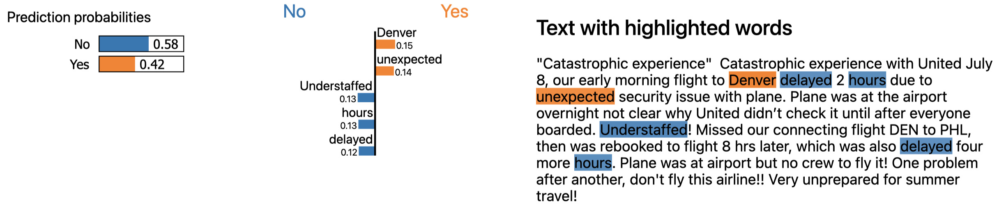

# Airline Review Sentiment Analysis
***
**Author:** Ron Lodetti Jr.


## Overview
***
In this project, we aimed to enhance customer sentiment and loyalty for a popular airline by analyzing over 20,000 historical customer reviews. The primary challenge lay in identifying the most impactful factors on customer satisfaction from a broad dataset, leading to a focus on Natural Language Processing (NLP) to predict customer recommendations accurately.

The preparation phase involved train-test splits to prevent data leakage, punctuation removal, and conversion of reviews to lowercase to standardize the data. For Bag-of-Words models, we lemmatized reviews and created a TF-IDF matrix, selecting the 20,000 most relevant word vectors. Sequential models involved converting reviews into sequence vectors and using GloVe embeddings for an embedding matrix. This approach ensured our models could accurately interpret the nuanced language of customer reviews.

We tested a broad range of models, beginning with a dummy classifier and basic logistic regression for baseline comparisons. Our exploration included both Bag-of-Words and Sequential models, leveraging packages like Scikit-learn for logistic regression, MultinomialNB, GradientBoostingClassifier, RandomForestClassifier, and Keras for Recurrent Neural Networks (RNN) with GloVe embeddings. The choice of models was guided by the need to accurately capture the sentiment expressed in textual reviews, with parameter tuning done using RandomizedSearchCV.

The final model is a Multi-Layer Percceptions model that achieved a 92% accuracy and 97% AUC on a previously unseen test set. We then used Local Interpretable Model-Agnostic Explanations (LIME) to uncover the strong influence of punctuality and kind customer service. 

## Business Problem
***
A popular airline company wants to increase customer sentiment and foster loyalty through improving customer service. Some difficulties include the many different areas the company could focus on, such as flight attendant training, food quality, seat comfort, as well as the challenge of manually reviewing survey data.

The airline has tasked me with analyzing over 20,000 historical reviews to help predict customer satisfaction and identify the most influential features responsible for customer satisfaction.

By creating a predictive model to analyze customer sentiment at scale, our project aims to provide the airline with the insights needed to make informed decisions, ultimately improving the customer experience, fostering loyalty, and enhancing the brand's competitive edge in the market.

## Data Understanding

The original dataset was collected from from [airlineequallity.com](https://www.airlinequality.com/review-pages/a-z-airline-reviews/) by 
Juhi Bhojani. You can find more details about their collection process at their [GitHub](https://github.com/Juhibhojani/Airline-Reviews-). I found and downloaded the data directly from [Kaggle](https://www.kaggle.com/datasets/juhibhojani/airline-reviews) in the form of a csv. 

While originally including 20 columns, I decided to select just 3 of them to focus this project on Natual Language Processing. The `Review_Title` and `Review` columns will be combined to serve as the review texts and the target will be the `Recommended` column which consists of either "yes" or "no".


## Data Preparation
***

Preparation began by creating train-test splits to prevent data leakage. I then cleaned the data by removing punctuation and converting all reviews to lowercase. From there, data prep diverged based on the type of model being used.

Bag-of-Words models:
- Lemmatized the reviews
- Created a data processing pipeline which includes:
    - Converting reviews to a TF-IDF maxtrix
    - Selecting the 20,000 most relevant word vectors

Sequantial models:
- Converted reviews into sequence vectors
- Created an embedding matrix using pre-trained GloVe embeddings.


## Data Modeling
***

Modeling began by using a dummy classifier and a basic logistic regression model as a baseline to compare to later. I then tested a number of models, gridsearching for optimal parameters. 

**Modeling Overview:**

Baseline Models
- Dummy Classifier
- Logistic Regression (Basic)

Bag-of-Words Models
- Logistic Regression
- MultinomialNB
- GradientBoostingClassifier
- RandomForestClassifier
- Multi-Layer Perceptrons (MLP)

Sequential Models
- Recurrent Neural Network (RNN)
- RNN with GloVe Pretrained Embedding Layer


## Evaluation
***
Our final model was evaluated on a previously unseen test dataset to assess its performance in classifying reviews as either "Yes" or "No". The model demonstrated an accuracy of 92%, which represents a modest improvement over our baseline model's accuracy of 90.8%. This performance is substantially superior to that of the dummy model, which had an accuracy of only 50%.

This increase in accuracy, while seemingly small, is critical in the context of our project's objectives. It underscores the effectiveness of the chosen model and techniques in capturing the nuances of the data that were not as effectively addressed by the baseline model. Additionally, the comparison with the dummy model, which makes predictions based on no information about the data, highlights the value added by our modeling approach.


### Model Interpretation
Using LIME to see which words were the most influential for recommendations. Common themes include an importance on punctuality and customer service. 



## Conclusions
***
### Recommendations
I  recommend that the airline adopts our final model for classifying customer reviews. This tool can enable the continuous monitoring of customer feedback through a live tally of "Yes" and "No" reviews across any desired timeframe, providing valuable insights for enhancing service quality and customer satisfaction.

Our analysis unequivocally shows that punctuality significantly impacts customer satisfaction. Therefore, I suggest the marketing department leverages this finding by orchestrating a campaign that underscores our airline's commitment to timeliness. A possible campaign message could be: "Choose the airline with the fewest delays—because we value your time." Such a strategy not only highlights our strengths but also positions us favorably against competitors with higher instances of delays.

Furthermore, I strongly advise placing a renewed focus on the customer service department, particularly in terms of training and preparedness. It's essential that all staff members are fully informed about the range of accommodations and solutions available to support passengers during challenging situations. 

### Limitations
One of the primary limitations of this project was the decision to exclude certain features from the original dataset in our model development phase. Notably, variables such as Overall_Rating, Route, and Seat_Comfort, among others, were not considered. The exclusion of these features, while simplifying the initial model, may have restricted our ability to capture the full spectrum of factors influencing customer recommendations.
  
### Next Steps
To improve the predictive model and provide deeper insights for the marketing department, I plan to integrate additional features from the initial dataset. I am particularly interested in analyzing specific ratings such as Seat Comfort, Cabin Staff Service, Food & Beverages, Ground Service, and Value for Money. Additionally, I aim to explore potential correlations between departure/arrival locations and flight duration to ascertain their impact on customer satisfaction.

Incorporating these elements will allow for a more sophisticated analysis of customer feedback, potentially revealing hidden patterns and insights. Such discoveries are expected to guide targeted improvements in the airline's services. This comprehensive approach will also deepen our understanding of the primary factors influencing customer satisfaction and recommendation behaviors, enabling the formulation of more accurately targeted strategic interventions.

## For More Information

See the full analysis in the [Jupyter Notebook](./airline_review_sentiment_analysis.ipynb) or review this [presentation](./airline_review_sentiment_analysis_presentation.pdf).

For additional info, contact Ron Lodetti at [ron.lodetti@gmail.com](mailto:ron.lodetti@gmail.com)

## Repository Structure
```
├── src
│   ├── __init__.py
│   └── code.py
├── notebooks
│   └── model_scoreing.ipynb
├── data
├── images
├── README.md
├── requirements.txt
├── airline_review_sentiment_analysis_presentation.pdf
└── airline_review_sentiment_analysis.ipynb
```
